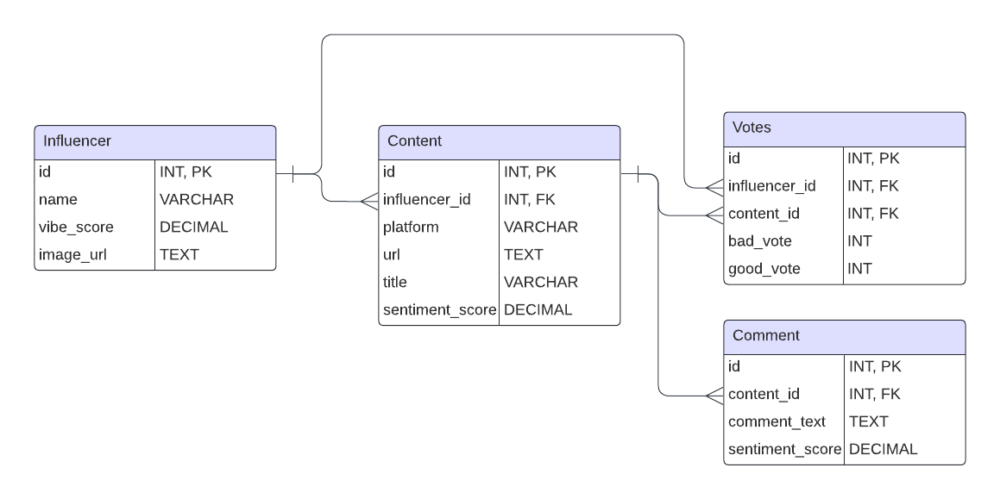

# VibeCHECK Project

## Project Overview

VibeCHECK is a web-based application that allows users to analyze influencer behavior and public sentiment. Users can view content related to influencers, such as YouTube videos and comments, and vote whether the influencer's vibe is 'good' or 'bad.' The system analyzes scraped data from YouTube and stores it in a MySQL database. Users will be able to vote on influencer behavior based on publicly available content and comments in the future. (will be further developed to input datas from tmz too.)

## Data Model

The project follows a structured relational database schema using **MySQL**. The data is organized into four key tables:

- **Influencers**: Contains information about influencers.

  - `id`: INT, Primary Key
  - `name`: VARCHAR, Influencer's name
  - `vibe_score`: DECIMAL, Calculated score based on votes - to be made

- **Content**: Stores information about influencers' content (e.g., posts or videos).

  - `id`: INT, Primary Key
  - `influencer_id`: INT, Foreign Key references `influencers`
  - `platform`: VARCHAR, The platform of the content (e.g., YouTube)
  - `url`: TEXT, Link to the content
  - `title`: VARCHAR, Title of the content

- **Comments**: Stores the comments for each content.

  - `id`: INT, Primary Key
  - `content_id`: INT, Foreign Key references `content`
  - `comment_text`: TEXT, Comment itself
  - `sentiment_score`: DECIMAL, Sentiment score for the comment - to be made

- **Votes**: Tracks user votes on influencer content.
  - `id`: INT, Primary Key
  - `influencer_id`: INT, Foreign Key references `influencers`
  - `content_id`: INT, Foreign Key references `content`
  - `vote`: ENUM ('good', 'bad'), Represents how people voted - to be made

### ER Diagram



### SQL Database:

We chose SQL (MySQL) for the following reasons:

- **Relational Data**: SQL is ideal because the relationships between influencers, content, and comments are clear and structured.
- **Data Integrity**: MySQL enforces strict data integrity with foreign keys to maintain consistency.
- **Efficiency**: SQL allows for efficient querying of structured data, which fits our needs as the data we're working with (influencers, content, votes) follows a well-defined structure.

While MongoDB offers flexibility in schema design, our need for structured data and complex relationships makes SQL a better choice for this project.

## Setup Instructions

### Prerequisites

- **Python 3.8 or higher**
- **MySQL Server** (installed and running)
- **pip** (Python package manager)

### Installation Steps

1. **Clone the Repository**
   ```
   git clone https://github.com/your-username/vibecheck.git](https://github.com/Kyrie21323/FinalProject.git
   cd vibecheck
   ```
2. **Navigate to the project directory**(??)

```
cd path/to/finalproject
```

3. **Set Up Virtual Environment**

```
python -m venv .venv
#On Windows:
.venv\Scripts\activate
#On macOS/Linux:
source .venv/bin/activate
```

4. **Install Required Packages - requirements.txt file**

```
pip install -r requirements.txt
```

5. **Set up your .env file**
  - Create a new file in the project root directory and name it .env
  - Open the .env file in a text editor
  - Add your MySQL connection details in the following format:

```
DB_HOST=your_mysql_host
DB_USER=your_mysql_username
DB_PASS=your_mysql_password
DB_NAME=your_database_name
```
  - Replace the placeholders with your actual MySQL connection details
  - Save and close the .env file

6. **Create the database and tables, by running the main.py script**

```
python main.py
```

## Ethics Considerations

1. **YouTube**

   - **Adhere to API Policies**: Use YouTube’s official API for data collection, following its terms of service and API usage limits. Avoid scraping the website directly as it may violate YouTube’s guidelines.
   - **Respect Content Ownership**: Videos and comments are user-generated and protected by copyright. Ensure that any collected data is used for non-commercial, educational, or research purposes and appropriately credits creators.
   - **Minimize Impact and Privacy**: Avoid scraping or collecting personal data like user profiles or private information. Be transparent about how data is used, especially when it involves public comments or video metadata.

2. **TMZ**
   This project involves the use of web scraping techniques to extract celebrity headlines from TMZ's public website. Web scraping, while a valuable tool for data collection, must be performed responsibly and ethically. The below outlines the ethical considerations for this project.

   - **Respect Terms of Service and Ownership**: Adhere to TMZ's terms of service, respect intellectual property, and use the scraped data only for non-commercial purposes.
   - **Minimize Website Impact**: Limit scraping frequency to avoid server overload and ensure responsible data collection.
   - **Ensure Transparency**: Attribute TMZ as the data source and avoid sharing personally identifiable information.

3. **Reddit**
   - **Follow Reddit's API Terms**: Use Reddit’s official API to gather data rather than web scraping, following the platform's terms of service and API rules.
   - **Respect User Privacy**: Posts and comments on Reddit can contain personal or sensitive information. Avoid collecting or sharing identifiable data without consent, and ensure that content is anonymized when possible.
   - **Attribution and Responsible Use**: Attribute Reddit as the source of the data and avoid using the data for commercial purposes unless permission is granted. Ensure data is not taken out of context or used to mislead.

## YouTube Data Integration
The project utilizes the YouTube Data API v3 to extract data from YouTube channels. This includes channel statistics, video details, and top comments. The following steps outline the process:

### API Setup:
- Obtain an API key from the Google Developer Console.
- Use the googleapiclient.discovery library in Python to create a service object for interacting with the YouTube API.
### Fetching Channel Statistics:
- Use the channels().list method to retrieve channel details such as subscriber count, view count, and video count.
- Store this data in a structured format for analysis.
### Extracting Video Information:
- Retrieve the latest video link from a channel's upload playlist using `playlistItems().list`.
- Gather video statistics and metadata for further sentiment analysis.
### Sentiment Analysis:
- Perform sentiment analysis on comments retrieved from videos using natural language processing (NLP) techniques.
- Use this data to determine the general sentiment of viewers towards specific content or influencers.
### Data Storage and Visualization:
- Store collected data in pandas DataFrames for easy manipulation and analysis.
- For now we are exporting data to CSV files for reporting purposes, we have our database outlined and in future we'll store the data to the database according to the format outlined above.

### Future Enhancements
- Integrate additional social media platforms for more comprehensive influencer monitoring.
- Implement machine learning algorithms to predict future trends in influencer popularity.
- Enhance user engagement features by allowing discussions or sharing of opinions within the app.

# FastAPI Application for Database Access

This FastAPI application provides RESTful API endpoints to access data from four tables in a MySQL database: `influencers`, `content`, `comments`, and `votes`.

## Prerequisites

- Python 3.7+
- MySQL Server
- Necessary Python packages listed in `requirements.txt`

## Installation

1. **Clone the Repository**

   ```bash
   git clone <repository-url>
   cd <repository-directory>

`pip install fastapi uvicorn mysql-connector-python python-dotenv pandas`
or 
`pip install -r requirements.txt`

DB_HOST=<your-database-host>
DB_USER=<your-database-user>
DB_PASS=<your-database-password>
DB_NAME=<your-database-name>

## Running the Application
Start the FastAPI Server
- Use Uvicorn to run the FastAPI application:
`uvicorn database_api:app --reload`

this will give us localhost link for the API access: 

### Access API Endpoints
- The following endpoints are available:\
   GET /influencers: Retrieve all records from the influencers table.\
   GET /content: Retrieve all records from the content table.\
   GET /comments: Retrieve all records from the comments table.\
   GET /votes: Retrieve all records from the votes table.\
   
